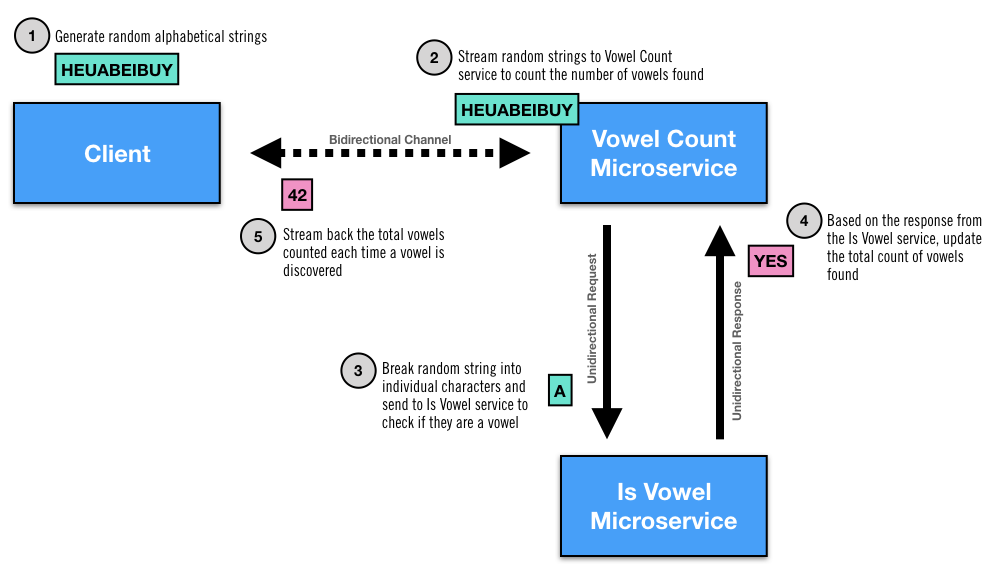

# proteus-vowelcount-example
An example of how easy it is to orchestrate interactions between multiple microservices with [Netifi Proteus](https://www.netifi.com).

The example works as follows:

1. The client generates random alphabetic strings.
2. The client streams the randomly generated strings to the vowelcount microservice over a bidirectional channel.
3. The vowelcount microservice splits the incoming strings into a stream of individual characters which it then sends one by one to the isvowel microservice using request/reply semantics.
4. The isvowel microservice determines if the character is a vowel and sends back an appropriate boolean response to the vowelcount microservice.
5. If a vowel was identified by the isvowel microservice, the vowelcount microservice increments its internal vowel counter and streams a message to the client with the latest vowel count.

## Prerequisites
This example requires a running Proteus Broker.

## Running the Example
TODO

## Bugs and Feedback
For bugs, questions, and discussions please use the [Github Issues](https://github.com/gregwhitaker/proteus-vowelcount-example/issues).

## License
Copyright 2018 Greg Whitaker

Licensed under the Apache License, Version 2.0 (the "License");
you may not use this file except in compliance with the License.
You may obtain a copy of the License at

   http://www.apache.org/licenses/LICENSE-2.0

Unless required by applicable law or agreed to in writing, software
distributed under the License is distributed on an "AS IS" BASIS,
WITHOUT WARRANTIES OR CONDITIONS OF ANY KIND, either express or implied.
See the License for the specific language governing permissions and
limitations under the License.
